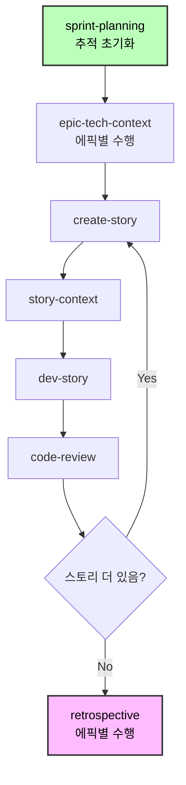
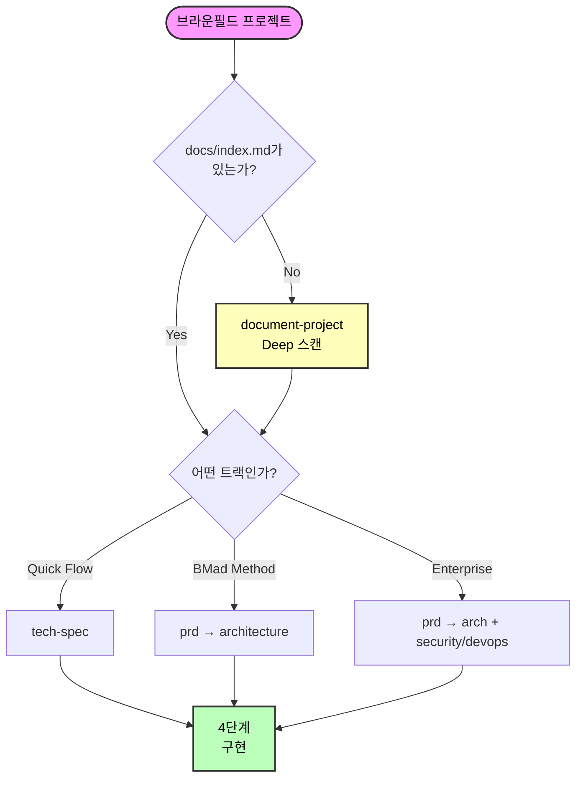

# BMad 방법론 브라운필드 개발 가이드

**기존 코드베이스 작업을 위한 완벽 가이드**

**소요 시간:** 약 35분

---

## 빠른 탐색 (Quick Navigation)

**바로 가기:**

- [빠른 참조 (Quick Reference)](#빠른-참조-quick-reference) - 명령어 및 파일
- [일반적인 시나리오 (Common Scenarios)](#일반적인-시나리오-common-scenarios) - 실제 예시
- [모범 사례 (Best Practices)](#모범-사례-best-practices) - 성공 팁

---

## 브라운필드(Brownfield) 개발이란?

브라운필드 프로젝트는 처음부터 새로 시작하는 것이 아니라 기존 코드베이스 내에서 작업하는 것을 의미합니다:

- **버그 수정 (Bug fixes)** - 단일 파일 변경
- **소규모 기능 (Small features)** - 기존 모듈에 추가
- **기능 세트 (Feature sets)** - 다수의 관련 기능
- **주요 통합 (Major integrations)** - 복잡한 아키텍처 추가
- **시스템 확장 (System expansions)** - 엔터프라이즈 규모의 개선

**그린필드(신규 개발)와의 주요 차이점:** 기존 패턴, 아키텍처 및 제약 조건을 이해하고 존중해야 합니다.

**핵심 원칙:** AI 에이전트가 변경 사항을 효과적으로 계획하거나 구현하려면, 먼저 기존 코드를 이해하기 위한 포괄적인 문서가 필요합니다.

---

## 시작하기 (Getting Started)

### 기획 트랙 이해하기

전체 트랙에 대한 세부 정보는 [규모 적응형 시스템(Scale Adaptive System)](./scale-adaptive-system.md)을 참조하세요.

**브라운필드 트랙 한눈에 보기:**

| 트랙 | 범위 | 일반적인 스토리 수 | 주요 차이점 |
| --- | --- | --- | --- |
| **Quick Flow** | 버그 수정, 소규모 기능 | 1-15 | 영향을 받는 코드와 패턴을 반드시 이해해야 함 |
| **BMad Method** | 기능 세트, 통합 | 10-50+ | 기존 아키텍처와 통합 |
| **Enterprise Method** | 엔터프라이즈 확장 | 30+ | 전체 시스템 문서화 + 규정 준수 필요 |

**참고:** 스토리 수는 정의가 아닌 지침입니다. 트랙은 기획 필요성에 따라 선택됩니다.

### 브라운필드를 위한 트랙 선택

`workflow-init`을 실행하면 브라운필드 상황을 지능적으로 처리합니다:

**1단계: 발견된 내용 표시**

- 오래된 기획 문서 (PRD, 에픽, 스토리)
- 기존 코드베이스

**2단계: 작업 내용 질문**

> "이것들은 진행 중인 작업인가요, 이전 작업인가요, 아니면 제안된 작업인가요?"

- **(a) 진행 중인 작업 (Works in progress)** → 아티팩트를 사용하여 레벨 결정
- **(b) 이전 작업 (Previous effort)** → 새로운 작업에 대해 설명 요청
- **(c) 제안된 작업 (Proposed work)** → 아티팩트를 지침으로 사용
- **(d) 해당 없음 (None of these)** → 작업자가 직접 설명

**3단계: 설명 분석**

- 키워드 분석: "수정(fix)", "버그(bug)" → Quick Flow / "대시보드", "플랫폼" → BMad Method / "엔터프라이즈", "멀티 테넌트" → Enterprise Method
- 복잡도 평가
- 제안된 트랙 확인

**핵심 원칙:** 시스템은 오래된 아티팩트를 참고용으로만 사용하고, **현재** 수행하려는 작업에 대해 먼저 질문합니다.

**예시: 오래되고 복잡한 PRD가 있지만, 새로운 작업은 단순한 경우**

```
System: "PRD.md 발견 (BMad Method 트랙, 30개 스토리, 6개월 전 작성됨)"
System: "이것은 진행 중인 작업인가요, 아니면 이전 작업인가요?"
You: "이전 작업입니다 - 지금은 버그만 수정하려고 합니다."
System: "현재 작업에 대해 말씀해 주세요."
You: "결제 수단 열거형(enum) 업데이트"
System: "Quick Flow 트랙 (tech-spec 접근 방식). 맞습니까?"
You: "네"
✅ Quick Flow 워크플로우 생성됨
```

---

## 0단계: 문서화 (필수적인 첫 단계)

🚨 **브라운필드 프로젝트의 경우: 기획 전에 반드시 AI가 사용할 수 있는 적절한 문서가 있는지 확인하십시오.**

### 기본 권장 사항: document-project 실행

**모범 사례:** **확인되고, 신뢰할 수 있으며, AI에 최적화된 문서**가 없다면 `document-project` 워크플로우를 실행하세요.

### 왜 document-project가 거의 항상 정답인가

기존 문서는 AI 워크플로우를 깨뜨리는 품질 문제를 가지고 있는 경우가 많습니다:

**일반적인 문제점:**

- **너무 많은 정보 (TMI):** 수십, 수백 개의 2단계 섹션이 포함된 거대한 마크다운 파일
- **최신화 안 됨:** 최근 코드 변경 사항이 문서에 반영되지 않음
- **잘못된 형식:** AI 에이전트가 아닌 인간을 위해 작성됨 (구조, 인덱스, 명확한 패턴 부족)
- **불완전한 커버리지:** 중요한 아키텍처, 패턴 또는 설정 정보 누락
- **일관성 없는 품질:** 일부 영역은 잘 문서화되어 있으나, 다른 영역은 전혀 없음

**AI 에이전트에 미치는 영향:**

- AI 에이전트가 거대한 파일을 읽다가 토큰 제한에 도달함
- 오래된 문서로 인해 환각(Hallucination) 발생 (에이전트가 옛날 패턴이 여전히 유효하다고 생각함)
- 구조 누락으로 인해 에이전트가 관련 정보를 찾지 못함
- 불완전한 커버리지는 잘못된 가정으로 이어짐

### 문서화 결정 트리

**1단계: 기존 문서 품질 평가**

스스로에게 질문해 보세요:

- ✅ **최신**인가? (지난 30일 이내 업데이트)
- ✅ **AI 최적화**되었는가? (index.md, 명확한 섹션 구조, 파일당 500줄 미만)
- ✅ **포괄적**인가? (아키텍처, 패턴, 설정이 모두 문서화됨)
- ✅ AI 에이전트 사용을 위해 전적으로 **신뢰**하는가?

**답변 중 하나라도 '아니오'라면 → `document-project` 실행**

**2단계: 거대 문서 확인**

문서는 있지만 파일이 너무 큰 경우 (500줄 이상, 10개 이상의 2단계 섹션):

1. **먼저:** `shard-doc` 도구를 실행하여 큰 파일을 분할합니다:

   ```bash
   # BMad Master 또는 아무 에이전트 로드
   {bmad_folder}/core/tools/shard-doc.xml --input docs/massive-doc.md
   ```

   - 기본적으로 2단계 섹션 기준으로 분할
   - 체계적이고 관리 가능한 파일 생성
   - 콘텐츠 무결성 보존

2. **그 다음:** `index-docs` 작업을 실행하여 네비게이션 생성:

   ```bash
   {bmad_folder}/core/tasks/index-docs.xml --directory ./docs
   ```

3. **마지막으로:** 품질 검증 - 분할된 문서가 여전히 불완전하거나 오래된 것 같다면 → `document-project` 실행

### 4가지 실제 시나리오

| 시나리오 | 상황 | 조치 | 이유 |
| --- | --- | --- | --- |
| **A** | 문서 없음 | `document-project` | 유일한 옵션 - 처음부터 생성 |
| **B** | 문서는 있으나 거대하거나/오래되거나/불완전함 | `document-project` | 나쁜 문서를 신뢰하는 것보다 재생성하는 것이 안전함 |
| **C** | 문서는 좋으나 구조가 없음 | `shard-doc` → `index-docs` | 기존 콘텐츠를 AI용으로 구조화 |
| **D** | index.md가 포함된 AI 최적화 문서 확인됨 | 0단계 건너뛰기 | 드묾 - 100% 확신할 때만 |

### 시나리오 A: 문서 없음 (가장 흔함)

**조치: document-project 워크플로우 실행**

1. Analyst 또는 Technical Writer (Paige) 에이전트 로드
2. `*document-project` 실행
3. 스캔 레벨 선택:
   - **Quick** (2-5분): 패턴 분석, 소스 읽기 없음
   - **Deep** (10-30분): 중요 경로 읽기 - **권장**
   - **Exhaustive** (30-120분): 모든 파일 읽기

**산출물:**

- `docs/index.md` - 마스터 AI 진입점
- `docs/project-overview.md` - 개요 요약
- `docs/architecture.md` - 아키텍처 분석
- `docs/source-tree-analysis.md` - 디렉토리 구조
- 프로젝트 유형에 따른 추가 파일 (API, 웹 앱 등)

### 시나리오 B: 문서는 존재하지만 품질이 불명확/나쁨 (매우 흔함)

**조치: document-project 워크플로우 실행 (재생성)**

`docs/` 폴더가 있더라도 품질이 확신이 안 선다면 → **재생성하세요**.

**왜 인덱싱 대신 재생성인가?**

- 오래된 문서 → AI가 잘못된 가정 함
- 불완전한 문서 → AI가 누락된 정보를 지어냄
- TMI 문서 → AI가 토큰 제한에 걸려 핵심 정보를 놓침
- 인간 중심 문서 → AI에 필수적인 구조가 누락됨

**document-project의 기능:**

- 실제 코드베이스 스캔 (진실의 원천)
- 신선하고 정확한 문서 생성
- AI 소비에 맞게 적절히 구조화
- 관련성 있고 현재 유효한 정보만 포함

### 시나리오 C: 문서는 좋으나 구조가 필요함

**조치: 거대 파일 분할(Shard) 후 인덱싱**

**좋고 최신인 문서**가 있지만 파일이 너무 큰 경우:

**1단계: 대형 문서 분할**

```bash
# 거대 문서(500줄 이상 또는 10개 이상의 레벨 2 섹션) 각각에 대해
{bmad_folder}/core/tools/shard-doc.xml \
  --input docs/api-documentation.md \
  --output docs/api/ \
  --level 2  # ## 헤더 기준으로 분할 (기본값)
```

**2단계: 인덱스 생성**

```bash
{bmad_folder}/core/tasks/index-docs.xml --directory ./docs
```

**3단계: 검증**

- 생성된 `docs/index.md` 검토
- 분할된 파일이 각각 500줄 미만인지 확인
- 내용이 최신이고 정확한지 확인
- **조금이라도 이상하다면 → 대신 document-project 실행**

### 시나리오 D: 확인된 AI 최적화 문서 (드묾)

**조치: 0단계 건너뛰기**

모든 조건이 충족될 때만 건너뛰세요:

- ✅ `docs/index.md`가 존재하며 포괄적임
- ✅ 문서가 지난 30일 이내에 업데이트됨
- ✅ 모든 문서 파일이 500줄 미만이며 명확한 구조를 가짐
- ✅ 아키텍처, 패턴, 설정, API 표면을 다룸
- ✅ AI 소비를 위해 품질을 직접 검증했음
- ✅ 이전 AI 에이전트가 성공적으로 사용했음

**확신이 없다면 → document-project 실행** (10-30분 투자로 몇 시간의 혼란을 예방)

### document-project가 중요한 이유

AI 최적화 문서 없이는 워크플로우가 실패합니다:

- **tech-spec** (Quick Flow)이 스택/패턴을 자동 감지 못함 → 잘못된 가정
- **PRD** (BMad Method)가 기존 코드를 참조 못함 → 호환되지 않는 기능 설계
- **architecture**가 기존 구조 위에 빌드 못함 → 충돌하는 패턴 제안
- **story-context**가 기존 패턴을 주입 못함 → Dev 에이전트가 작동하는 코드를 재작성함
- **dev-story**가 구현을 지어냄 → 기존 통합을 깨뜨림

### 핵심 원칙

**의심스러우면 document-project를 실행하세요.**

잘못된 문서로 작업하는 AI 에이전트를 디버깅하느라 몇 시간을 허비하는 것보다, 신선하고 정확한 문서를 생성하는 데 10-30분을 쓰는 것이 낫습니다.

---

## 트랙별 워크플로우 단계

### 1단계: 분석 (선택 사항)

**워크플로우:**

- `brainstorm-project` - 솔루션 탐색
- `research` - 기술/시장 조사
- `product-brief` - 전략적 기획 (BMad Method/Enterprise 트랙 전용)

**사용 시기:** 복잡한 기능, 기술적 결정, 전략적 추가 사항

**건너뛸 시기:** 버그 수정, 잘 이해된 기능, 시간 민감한 변경

세부 사항은 [BMM README의 워크플로우 섹션](../README.md)을 참조하세요.

### 2단계: 기획 (필수)

**기획 접근 방식은 트랙에 따라 조정됩니다:**

**Quick Flow:** `tech-spec` 워크플로우 사용

- tech-spec.md 생성
- 기존 스택 자동 감지 (브라운필드)
- 사용자와 규칙(Convention) 확인
- 구현 준비된 스토리 생성

**BMad Method/Enterprise:** `prd` 워크플로우 사용

- FR(기능 요구사항)/NFR(비기능 요구사항)만 포함된 PRD.md 생성
- 기존 아키텍처 참조
- 통합 지점 계획
- 에픽+스토리는 아키텍처 단계 **이후**에 생성됨

**브라운필드 특화:** 트랙별 전체 워크플로우 경로는 [규모 적응형 시스템(Scale Adaptive System)](./scale-adaptive-system.md)을 참조하세요.

### 3단계: 솔루션 도출 (BMad Method/Enterprise 전용)

**브라운필드에 중요함:**

- 기존 아키텍처를 **먼저** 검토
- 통합 지점을 명시적으로 문서화
- 하위 호환성 계획
- 마이그레이션 전략 고려

**워크플로우:**

- `create-architecture` - 아키텍처 문서 확장 (BMad Method/Enterprise)
- `create-epics-and-stories` - 아키텍처 수립 후 에픽 및 스토리 생성
- `implementation-readiness` - 구현 전 검증 (BMad Method/Enterprise)

### 4단계: 구현 (모든 트랙)

**스토리 반복을 통한 스프린트 기반 개발:**



**상태 진행:**

- 에픽: `backlog → contexted`
- 스토리: `backlog → drafted → ready-for-dev → in-progress → review → done`

**브라운필드 구현 팁:**

1. **기존 패턴 존중** - 확립된 규칙을 따를 것
2. **통합 테스트 철저히** - 기존 코드와의 상호작용 검증
3. **기능 플래그 사용** - 점진적 배포 가능하게 함
4. **컨텍스트 주입 중요** - epic-tech-context 및 story-context가 기존 패턴을 참조함

---

## 모범 사례 (Best Practices)

### 1. 항상 문서화 먼저

코드를 알고 있더라도 AI 에이전트는 컨텍스트를 위해 `document-project` 산출물이 필요합니다. 기획 전에 실행하세요.

### 2. 현재 작업에 대해 구체적으로 명시

workflow-init이 작업에 대해 물을 때:

- ✅ "Apple Pay를 포함하도록 결제 수단 열거형 업데이트"
- ❌ "이것저것 수정"

### 3. 올바른 문서화 접근법 선택

- **문서는 좋은데 인덱스가 없나?** → `index-docs` 작업 실행 (빠름)
- **문서가 없거나 코드베이스 분석이 필요한가?** → `document-project` 실행 (Deep 스캔)

### 4. 기존 패턴 존중

Tech-spec 및 story-context가 규칙을 감지합니다. 명시적으로 현대화하는 경우가 아니라면 따르세요.

### 5. 통합 지점을 명시적으로 기획

tech-spec/architecture에 다음을 문서화하세요:

- 수정할 기존 모듈
- 통합할 API/서비스
- 새 코드와 기존 코드 간의 데이터 흐름

### 6. 점진적 배포 설계

- 새로운 기능에 기능 플래그 사용
- 롤백 전략 계획
- 하위 호환성 유지
- 필요한 경우 마이그레이션 스크립트 작성

### 7. 철저한 통합 테스트

- 기존 기능 회귀 테스트
- 통합 지점 검증
- 성능 영향 평가
- API 계약 확인

### 8. 스프린트 계획의 효과적 활용

- 4단계 시작 시 `sprint-planning` 실행
- 스토리 초안 작성 전 에픽 컨텍스트화
- 작업 진행에 따라 `sprint-status.yaml` 업데이트

### 9. 컨텍스트 주입 활용

- 스토리 초안 작성 전 `epic-tech-context` 실행
- 구현 전 항상 `story-context` 생성
- 이것들이 일관성을 위해 기존 패턴을 참조함

### 10. 지속적인 학습

- 각 에픽 후 `retrospective` 실행
- 학습 내용을 다음 스토리에 반영
- 발견된 패턴 업데이트
- 팀 간 인사이트 공유

---

## 일반적인 시나리오 (Common Scenarios)

### 시나리오 1: 버그 수정 (Quick Flow)

**상황:** 인증 토큰 만료로 인한 로그아웃 문제

**트랙:** Quick Flow

**워크플로우:**

1. **문서화:** 인증 시스템이 문서화되어 있다면 건너뛰고, 없다면 `document-project` 실행 (Quick 스캔)
2. **기획:** PM 로드 → `tech-spec` 실행
   - 버그 분석
   - 스택 감지 (Express, Jest)
   - 규칙 확인
   - tech-spec.md + 스토리 생성
3. **구현:** DEV 로드 → `dev-story` 실행
4. **검토:** DEV 로드 → `code-review` 실행

**시간:** 2-4시간

---

### 시나리오 2: 소규모 기능 (Quick Flow)

**상황:** 기존 인증 시스템에 "비밀번호 찾기" 추가

**트랙:** Quick Flow

**워크플로우:**

1. **문서화:** `document-project` 실행 (문서화되지 않은 경우 인증 모듈 Deep 스캔)
2. **기획:** PM 로드 → `tech-spec` 실행
   - Next.js 13.4, NextAuth.js 감지
   - 기존 인증 패턴 분석
   - 규칙 확인
   - tech-spec.md + 에픽 + 3-5개 스토리 생성
3. **구현:** SM 로드 → `sprint-planning` → `create-story` → `story-context`
   DEV 로드 → 각 스토리에 대해 `dev-story`
4. **검토:** DEV 로드 → `code-review`

**시간:** 1-3일

---

### 시나리오 3: 기능 세트 (BMad Method)

**상황:** 분석, 환경 설정, 활동이 포함된 사용자 대시보드 추가

**트랙:** BMad Method

**워크플로우:**

1. **문서화:** `document-project` 실행 (Deep 스캔) - 기존 UI 패턴 이해에 중요
2. **분석:** Analyst 로드 → `research` (분석 라이브러리 평가 시)
3. **기획:** PM 로드 → `prd` (FRs/NFRs 생성)
4. **솔루션:** Architect 로드 → `create-architecture` → `create-epics-and-stories` → `implementation-readiness`
5. **구현:** 스프린트 기반 (10-15개 스토리)
   - SM 로드 → `sprint-planning`
   - 에픽별: `epic-tech-context` → 스토리
   - DEV 로드 → 스토리별 `dev-story`
6. **검토:** 스토리 완료 시마다

**시간:** 1-2주

---

### 시나리오 4: 복잡한 통합 (BMad Method)

**상황:** 문서 편집기에 실시간 협업 기능 추가

**트랙:** BMad Method

**워크플로우:**

1. **문서화:** `document-project` 실행 (문서화되지 않은 경우 Exhaustive) - **필수**
2. **분석:** Analyst 로드 → `research` (WebSocket vs WebRTC vs CRDT)
3. **기획:** PM 로드 → `prd` (FRs/NFRs 생성)
4. **솔루션:**
   - Architect 로드 → `create-architecture` (실시간 레이어 확장)
   - Architect 로드 → `create-epics-and-stories`
   - Architect 로드 → `implementation-readiness`
5. **구현:** 스프린트 기반 (20-30개 스토리)

**시간:** 3-6주

---

### 시나리오 5: 엔터프라이즈 확장 (Enterprise Method)

**상황:** 단일 테넌트 SaaS 플랫폼에 멀티 테넌시 추가

**트랙:** Enterprise Method

**워크플로우:**

1. **문서화:** `document-project` 실행 (Exhaustive) - **필수**
2. **분석:** **필수**
   - `brainstorm-project` - 멀티 테넌시 접근 방식 탐색
   - `research` - 데이터베이스 샤딩, 테넌트 격리, 가격 책정
   - `product-brief` - 전략 문서
3. **기획:** PM 로드 → `prd` (포괄적인 FRs/NFRs)
4. **솔루션:**
   - `create-architecture` - 전체 시스템 아키텍처
   - `integration-planning` - 단계적 마이그레이션 전략
   - `create-architecture` - 멀티 테넌시 아키텍처
   - `validate-architecture` - 외부 검토
   - `create-epics-and-stories` - 에픽 및 스토리 생성
   - `implementation-readiness` - 임원 승인
5. **구현:** 단계적 스프린트 기반 (50개 이상의 스토리)

**시간:** 3-6개월

---

## 문제 해결 (Troubleshooting)

### AI 에이전트가 코드베이스를 이해하지 못함

**증상:**

- 제안이 기존 패턴과 맞지 않음
- 사용 가능한 컴포넌트를 무시함
- 기존 코드를 참조하지 않음

**해결책:**

1. Deep 스캔으로 `document-project` 실행
2. `docs/index.md` 존재 여부 확인
3. 문서 완전성 확인
4. 필요한 경우 특정 영역에 대한 심층 분석(Deep-dive) 실행

### 문서는 있지만 에이전트가 찾지 못함

**증상:**

- README.md, ARCHITECTURE.md가 존재함
- AI 에이전트가 이미 답변된 질문을 함
- `docs/index.md` 파일이 없음

**해결책:**

- **빠른 수정:** `index-docs` 작업 실행 (2-5분)
- **포괄적 해결:** `document-project` 워크플로우 실행 (10-30분)

### 통합 지점이 불명확함

**증상:**

- 새 코드를 기존 코드에 어떻게 연결할지 확신이 없음
- 어떤 파일을 수정해야 할지 불확실함

**해결책:**

1. `document-project`가 기존 아키텍처를 캡처했는지 확인
2. `story-context` 확인 - 통합 지점을 문서화해야 함
3. tech-spec/architecture에서 다음을 명시적으로 문서화:
   - 수정할 기존 모듈
   - 통합할 API/서비스
   - 새 코드와 기존 코드 간의 데이터 흐름
4. 통합 지침에 대해 아키텍처 문서 검토

### 기존 테스트가 깨짐

**증상:**

- 회귀 테스트 실패
- 이전에 작동하던 기능 고장

**해결책:**

1. 변경 사항을 기존 패턴과 대조하여 검토
2. API 계약이 변경되지 않았는지 확인 (의도적으로 버전을 올린 경우 제외)
3. `test-review` 워크플로우 실행 (TEA 에이전트)
4. 완료 조건(DoD)에 회귀 테스트 추가
5. 점진적 배포를 위한 기능 플래그 고려

### 일관성 없는 패턴이 도입됨

**증상:**

- 새로운 코드 스타일이 기존과 일치하지 않음
- 다른 아키텍처 접근 방식 사용됨

**해결책:**

1. 규칙 감지 확인 (Quick Spec Flow가 패턴을 감지해야 함)
2. 문서 검토 - `document-project`가 패턴을 캡처했는지 확인
3. `story-context` 사용 - 패턴 지침 주입
4. 코드 리뷰 체크리스트에 추가: 패턴 준수, 규칙 일관성
5. 회고(Retrospective)를 실행하여 편차를 조기에 식별

---

## 빠른 참조 (Quick Reference)

### 단계별 명령어

```bash
# 0단계: 문서화 (필요한 경우)
# Analyst 에이전트:
document-project        # 포괄적인 문서 생성 (10-30분)
# 또는 기존 문서에 대해 index-docs 작업 로드 (2-5분)

# 1단계: 분석 (선택 사항)
# Analyst 에이전트:
brainstorm-project      # 솔루션 탐색
research                # 데이터 수집
product-brief           # 전략적 기획 (BMad Method/Enterprise 트랙 전용)

# 2단계: 기획 (필수)
# PM 에이전트:
tech-spec               # Quick Flow 트랙
prd                     # BMad Method/Enterprise 트랙

# 3단계: 솔루션 도출 (BMad Method/Enterprise)
# Architect 에이전트:
create-architecture          # 아키텍처 확장
create-epics-and-stories     # 에픽 및 스토리 생성 (아키텍처 이후)
implementation-readiness       # 최종 검증

# 4단계: 구현 (모든 트랙)
# SM 에이전트:
sprint-planning              # 추적 초기화
epic-tech-context            # 에픽 컨텍스트
create-story                 # 스토리 초안
story-context                # 스토리 컨텍스트

# DEV 에이전트:
dev-story                    # 구현
code-review                  # 검토

# SM 에이전트:
retrospective                # 에픽 이후
correct-course               # 문제 발생 시
```

### 주요 파일

**0단계 산출물:**

- `docs/index.md` - **마스터 AI 진입점 (필수)**
- `docs/project-overview.md`
- `docs/architecture.md`
- `docs/source-tree-analysis.md`

**1-3단계 추적:**

- `docs/bmm-workflow-status.yaml` - 진행 상황 추적기

**2단계 기획:**

- `docs/tech-spec.md` (Quick Flow 트랙)
- `docs/PRD.md` (BMad Method/Enterprise 트랙 - FRs/NFRs만 포함)

**3단계 솔루션 도출:**

- 에픽 분류 (아키텍처 이후 생성됨)

**3단계 아키텍처:**

- `docs/architecture.md` (BMad Method/Enterprise 트랙)

**4단계 구현:**

- `docs/sprint-status.yaml` - **단일 진실 공급원**
- `docs/epic-{n}-context.md`
- `docs/stories/{epic}-{story}-{title}.md`
- `docs/stories/{epic}-{story}-{title}-context.md`

### 결정 순서도



---

## 예방 팁 (Prevention Tips)

**문제가 발생하기 전에 예방하세요:**

1. ✅ **브라운필드에는 항상 document-project 실행** - 나중에 컨텍스트 문제 예방
2. ✅ **복잡한 워크플로우에는 새 대화창 사용** - 환각 방지
3. ✅ **워크플로우 전 파일 존재 확인** - PRD, 에픽, 스토리 존재 여부 확인
4. ✅ **에이전트 메뉴 먼저 읽기** - 에이전트가 해당 워크플로우를 가지고 있는지 확인
5. ✅ **확신이 안 서면 더 간단한 트랙으로 시작** - 업그레이드하기 쉬움 (Quick Flow → BMad Method)
6. ✅ **상태 파일 업데이트 유지** - 필요시 수동 업데이트
7. ✅ **에픽 이후 회고 실행** - 문제 조기 발견
8. ✅ **단계 순서 준수** - 필수 단계를 건너뛰지 말 것

---

## 관련 문서 (Related Documentation)

- **[규모 적응형 시스템 (Scale Adaptive System)](./scale-adaptive-system.md)** - 트랙 및 복잡도 이해
- **[Quick Spec Flow](./quick-spec-flow.md)** - Quick Flow를 위한 패스트 트랙
- **[빠른 시작 가이드 (Quick Start Guide)](./quick-start.md)** - BMM 시작하기
- **[용어집 (Glossary)](./glossary.md)** - 주요 용어
- **[자주 묻는 질문 (FAQ)](./faq.md)** - 일반적인 질문
- **[워크플로우 문서 (Workflow Documentation)](../README.md#-workflow-guides)** - 전체 워크플로우 참조

---

## 지원 및 리소스 (Support and Resources)

**커뮤니티:**

- [Discord](https://discord.gg/gk8jAdXWmj) - #general-dev, #bugs-issues
- [GitHub Issues](https://github.com/bmad-code-org/BMAD-METHOD/issues)
- [YouTube Channel](https://www.youtube.com/@BMadCode)

**문서:**

- [테스트 아키텍트 가이드 (Test Architect Guide)](./test-architecture.md) - 포괄적인 테스트 전략
- [BMM 모듈 README](../README.md) - 전체 모듈 및 워크플로우 참조

---

_브라운필드 개발은 기존의 것을 이해하고 존중하면서 신중하게 확장하는 것입니다._
